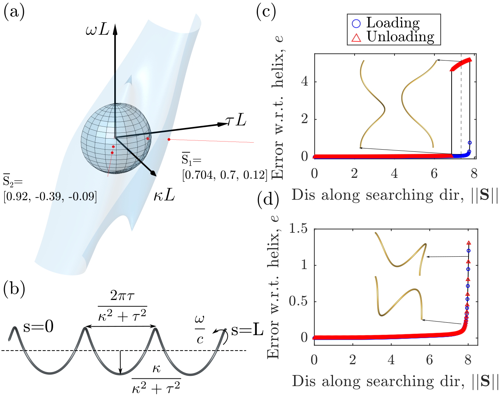

# Helix_Bifurcation_Types

Codes for studying the pitch-fork bifurcations of an initial rod with a helical centerline.

<p align="center">

<br>
<em> Figure 1. Studied systems and various types of pitch-fork bifurcations. </em>
</p>

***

## Simulation Codes
The ``simCodes`` folder contains the required codes for executing numeric experiments along various exploring directions in the parameter space as shown in Fig. 1(a).

### Dependencies
Install the following C++ dependencies:
- [Eigen](http://eigen.tuxfamily.org/index.php?title=Main_Page)
  - Eigen is used for various linear algebra operations.
    ```bash
    cd eigen-3.4.0 && mkdir build && cd build
    cmake ..
    sudo make install
    ```

- [OpenGL / GLUT](https://www.opengl.org/)
  - OpenGL / GLUT is used to render the knot using a simple graphic.
  - Simply install through apt package manager:
      ```bash
    sudo apt-get install libglu1-mesa-dev freeglut3-dev mesa-common-dev
    ```
- Lapack (*usually preinstalled on your computer*)

***
### Compiling
After completing all the necessary above steps, go to the folder of ``simCodes``.
```bash
mkdir build && cd build
cmake ..
make -j4
```

***

### Setting Parameters

All simulation parameters are set through a parameter file ```option.txt```. A template file ```template_option.txt``` is provided that can be used to construct ```option.txt```. All the parameters are defaulted in this project.

Specifiable parameters are as follows (we use SI units):
- ```RodLength``` - Contour length of the rod.
- ```youngM``` - Young's modulus of the rod's material.
- ```rodRadius``` - Cross-sectional radius of the rod.
- ```Poisson``` - Poisson's ratio of the rod's material.
- ```tol``` and ```stol``` - Small numbers used in solving the linear system. Fraction of a percent, e.g. 1.0e-3, is often a good choice.
- ```density``` - Density of the rod's material.
- ```maxIter``` - Maximum number of iterations allowed before the solver quits. 
- ```gVector``` - 3x1 vector specifying acceleration due to gravity.
- ```viscosity``` - Viscosity for applying damping forces.
- ```render (0 or 1) ```- Flag indicating whether OpenGL visualization should be rendered.
- ```saveData (0 or 1)``` - Flag indicating whether pull forces and rod end positions should be reocrded.
- ```v_constant``` - Rate of the boundary conditions along the exploring direction in the parameter space.
- ```c1``` and ```c2``` Define the exploring direction.
- ```kapB``` The curvature of the buckling point obtained from the theoretical analysis


***
### Running the Simulation
In this folder, we offer MatLab file ```ruSim.m``` for simple execution of the codes. However, before running Matlab, the user should define the environment variable ```export LD_PRELOAD=/lib/x86_64-linux-gnu/libstdc++.so.6``` Users can claim the exploring direction ``S`` and Poisson's ratio ``Poisson``at the beginning of the Matlab code. Then, the Matlab file will execute the simulation program. Here, we have the variable ``experiment``, which is used to control how we would like to run the simulation. If ``experiment = 0``, the simulation program will be executed and show the plot of exploring distance v.s. difference between the rod's configuration and the prescribed helical centerline. If ``experiment = 1``, the simulation program will generate the input file for the following robotic motion planning.

If the user does not have a license for MatLab, they can set parameters in the ``option.txt''. Once parameters are set to your liking, the simulation can be run from the terminal by running the provided script:
```bash
cd simCodes
./simDER option.txt
```

***

## Motion Planning Codes
The ``motion planning `` folder is a ros workspace that contains the required codes for generating the joint trajectory of a sawyer robot for doing robotic experiments along various exploring directions in the parameter space, as shown in Fig. 1(a).

***
### Dependencies
Install the following dependencies:
- [ROS](http://wiki.ros.org/Installation/Ubuntu)
  - The Robot Operating System (ROS) is a set of software libraries and tools that help you build robot applications. 
  - The installation instructions of ROS in Ubuntu are [Here](http://wiki.ros.org/Installation/Ubuntu). Following the instructions and install all the ROS in the computer.

- [User log-in file]
  - We need to add the environment variable to the ``.bashrc`` file in the Ubuntu system.
  - Open a terminal and then do the following operations:
    ```bash
    vim .bashrc
    ```
    Adding two lines in the bottom of the ``.bashrc`` file:
    ```bash
       source /opt/ros/$ROS_VERSION/setup.bash
       source /$MOTIONPLANNINGPATH$/devel/setup.bash
    ```
    Here ``$ROS_VERSION$`` is the version of ros, i.e. ``$ROS_VERSION`` should be ``noetic`` for Ubuntu 20.04. ``$MOTIONPLANNINGPATH`` is the path to the 
    ``motionPlanning`` folder.

***
### Compiling
After completing all the necessary above steps, go to the folder of ``motionPlanning``.
```bash
catkin_make
```
If an error about ``Unable to find either executable 'empy' or Python module 'em'...`` occurs. Compile the workspace with
```bash
catkin_make -DPYTHON_EXECUTABLE=/usr/bin/python3
```
***

### Setting Parameters

All motion planning parameters are set through a launch file ```helix_run.launch```. The launch file is located in the subfolder ``motionPlanning/src/helix_text/launch/helix_run.launch``. There are a few parameters in the launch file, and we justify the meaning of each parameter here.

- ```group_name``` - Name of planning group(robot).
- ```tip_link``` - The frame of the manipulator.
- ```base_link``` - The frame of the robot base (world frame).
- ```world_frame``` - The world frame.
- ```filename``` - The path of the generated input simulation data file (which is usually under ```${Prefix}/simCodes/datafiles/{sim_file}.txt```).
- ```savefile``` - The path to save the planned joint trajectory.
- ```offset``` - 3x1 vector to define the position trajectory in the world frame.
- ```trajectory/seed_pose``` - A joint seed for solving the trajectory
- ```visualization/min_point_distance```- The distance of the visualized discrete trajectory in rviz.

Note that the user can visualize the planned path in ```rviz```, the user should change the arg ```use_rviz``` in ```helix_setup.launch``` to ```true```. However, it is not recommended cause viz requires the graphics card driver setup in the workstation for running the codes.

When doing the motion planning, the main parameters that need to be adjusted are ``filename``, ``savefile``, and ``offset``.

***
### Running the planning codes
After completing the above steps, the user should open a terminal and go to the subfolder ``motionPlanning``, then run the provided script:
```bash
 roslaunch helix_test helix_setup.launch 
```
to establish and visualize the planning environment in rviz.

Then, the user should generate the input file with simulation by executing the simulation codes with the ``experiment = 1``. Then, the user should adjust ``filename`` in the ``helix_run.launch`` to the path of the input file and adjust ``savefile`` to the path to store the planned joint trajectory solutions. To do the motion planning, the user should run the provided script in another opened terminal:
```bash
 roslaunch helix_test helix_run.launch 
```
## Motion Planning Codes (with Docker)
The motion planning code is built using ROS Melodic, which is designed for Ubuntu 18.04, limiting its compatibility with other Linux distributions. To address this, we provide instructions on how to use docker to run the code, regardless of your Linux distribution.

***
### Dependencies
Install the following dependencies:
- [Docker](https://docs.docker.com/engine/install/ubuntu/)
***
### Setting parameters
All motion planning parameters are set through a launch file ```helix_run.launch```. The launch file is located in the subfolder ``motionPlanning/src/helix_text/launch/helix_run.launch``. There are a few parameters in the launch file, and we justify the meaning of each parameter here.

- ```group_name``` - Name of planning group(robot).
- ```tip_link``` - The frame of the manipulator.
- ```base_link``` - The frame of the robot base (world frame).
- ```world_frame``` - The world frame.
- ```filename``` - The path of the generated input simulation data file (which should be ```/root/simCodes/datafiles/${sim_file}.txt```).
- ```savefile``` - The path to save the planned joint trajectory (which should be ```/root/motionPlanning/src/helix_text/saveData/${save_file}.txt```).
- ```offset``` - 3x1 vector to define the position trajectory in the world frame.
- ```trajectory/seed_pose``` - A joint seed for solving the trajectory
- ```visualization/min_point_distance```- The distance of the visualized discrete trajectory in rviz.

Note that the user must turn off the visualization of ```rviz``` here. The user should change the arg ```use_rviz``` in ```helix_setup.launch``` to ```false```.

### Running codes with docker
Once the parameters are set. The user should navigate to the folder ```motionPlanning``` first:
```bash
 cd motionPlanning 
```
Then, the user can build a docker image:
```bash
 docker build -t my_motion_planning_image . 
```
Next, the use can run the docker image to execute the motion planning with the parameters set before.
```bash
docker run -it --rm \
    --gpus all \
    --name my_motion_planning_container \
    -e DISPLAY=$DISPLAY \
    -e XAUTHORITY=$XAUTHORITY \
    -v /tmp/.X11-unix:/tmp/.X11-unix \
    -v $XAUTHORITY:/root/.Xauthority \
    -v /$(dirname "$PWD")/motionPlanning:/root/motionPlanning \
    -v /$(dirname "$PWD")/simCodes:/root/simCodes \
    my_motion_planning_image
```
We can find the planned robot joint trajectory is saved under the path specified by the user in the arg ```savefile``` in the ```helix_run.launch```.

## Data Processing
The ``DataProcessing`` folder contains the codes and files for classifying the buckling points from experimental data. 

### Dependencies
The user should have `Matlab` installed on the computer. This script also uses the ``Robotics System Toolbox``
- [Robotics System Toolbox](https://www.mathworks.com/products/robotics.html)
  - Robotics System Toolbox rovides tools and algorithms for designing, simulating, testing, and deploying manipulator and mobile robot applications. 
  - Free trial of Robotics System Toolbox in `MatLab` are [Here](https://www.mathworks.com/campaigns/products/trials.html). Following the instructions and install them in the computer.

### Data Explanation
The ``Joints`` folder contains the joint trajectory inputted to the robots. The ``Simulations`` folder contains the simulation data. The ``Observations`` contains the raw experimental data. For the files in the ``Observation`` folder, each row is the sampled data, which is a 1 x 12 vector. The 1st to 7th elements are the joint positions expressing the robot's configuration; the 8th to 10th elements are the raw 3D position of the attached marker in the camera frame; the 11th to 12th are the pixel coordinates of the attached marker in the image domain.

### Running the Codes
The ``PlotFunc`` folder contains the main scripts and relevant functions. The main script is named as ``processAllData.m``. Users can adjust the boolean variable ``withTwist`` to ``True`` or ``False`` to see the processed results of the manipulated rod with the external twisting moment or without external moment.

***
